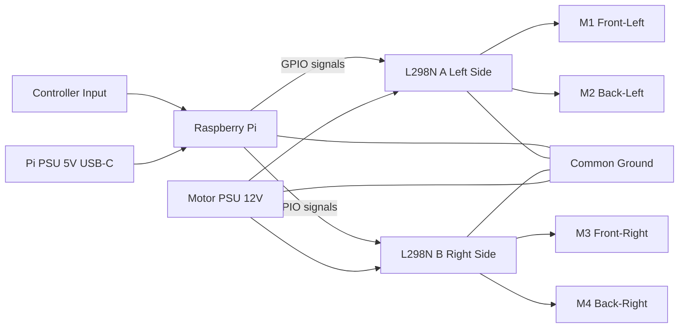

# GPIO Wiring Guide - Raspberry Pi with L298N Motor Controllers

This guide focuses on **wiring workflow and bring-up**.

For exact wiring maps (GPIO-to-IN pins, OUTx-to-motor posts, and detailed power terminal diagrams), use:
- [L298N_DUAL_DRIVER_DIAGRAM.md](L298N_DUAL_DRIVER_DIAGRAM.md)

For wheel A/B placement and mecanum movement concepts, use:
- [MECANUM_WHEEL_INSTALL_AND_MOVEMENT.md](MECANUM_WHEEL_INSTALL_AND_MOVEMENT.md)

## Hardware Overview

- **Raspberry Pi 5 (or Pi 4, 3, Zero 2 W)** - Main controller
- **2x L298N Motor Driver Boards** - Dual H-bridge motor controllers
- **4x DC Motors** - Mecanum wheel configuration
- **Two power sources**:
  - Pi PSU: 5V USB-C for Raspberry Pi
  - Motor PSU: 12V battery/supply for L298N motor power

## Wiring Architecture (Mermaid)



## Software Setup

Install required libraries before testing motors.

### For Raspberry Pi 5

```bash
sudo apt update
sudo apt install -y python3-evdev python3-rpi-lgpio
```

### For Raspberry Pi 4 and older

```bash
sudo apt update
sudo apt install -y python3-evdev python3-rpi.gpio
```

## Wiring Order (Recommended)

1. **Power off everything** (Pi and motor PSU disconnected).
2. **Wire motor outputs first** using [L298N_DUAL_DRIVER_DIAGRAM.md](L298N_DUAL_DRIVER_DIAGRAM.md).
3. **Wire GPIO signal pins** from Pi to both L298N boards (use the exact map in the diagram doc).
4. **Wire power terminals**:
   - Motor PSU `+` to each L298N `+12V/VS`
   - Motor PSU `-` to each L298N `GND`
   - Pi `GND` to the same common ground network
5. **Leave Pi 5V isolated** from L298N motor `+12V` rail.
6. **Confirm ENA/ENB jumpers are installed** (unless intentionally using EN pins for PWM).

## Pre-Power Checklist

- [ ] No loose strands or reversed polarity at L298N power terminals
- [ ] Common ground present between Pi and both L298N boards
- [ ] Pi 5V is not connected to motor `+12V`
- [ ] OUT wires match motor mapping in [L298N_DUAL_DRIVER_DIAGRAM.md](L298N_DUAL_DRIVER_DIAGRAM.md)
- [ ] IN wires match GPIO mapping in [L298N_DUAL_DRIVER_DIAGRAM.md](L298N_DUAL_DRIVER_DIAGRAM.md)
- [ ] Both boards have ENA/ENB jumpers fitted

## Testing Sequence

1. **Controller read test**
   ```bash
   python3 examples/read_controller.py
   ```
2. **Motor test (GPIO access needs sudo)**
   ```bash
   sudo python3 tests/test_motors.py
   ```
3. **Full robot test**
   ```bash
   sudo python3 run_robot.py
   ```

## Troubleshooting

### GPIO access errors

- Run motor scripts with `sudo`.
- Pi 5 should use `python3-rpi-lgpio`; older Pi models should use `python3-rpi.gpio`.

### Motors do not move

- Check motor PSU voltage/current capability.
- Confirm ENA/ENB jumpers are installed.
- Verify common ground between Pi and L298N boards.
- Re-check mapping in [L298N_DUAL_DRIVER_DIAGRAM.md](L298N_DUAL_DRIVER_DIAGRAM.md).

### One wheel spins wrong way

- Swap that motor's two OUT wires (or invert in software).

## Reference Links

- **Project Page:** https://messyprogress.substack.com/p/easy-robotics-with-a-3d-printer-and
- **Motor Controllers:** https://www.amazon.com/dp/B07BK1QL5T
- **Raspberry Pi GPIO:** https://pinout.xyz
