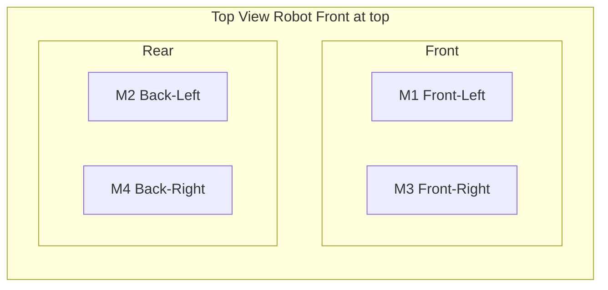
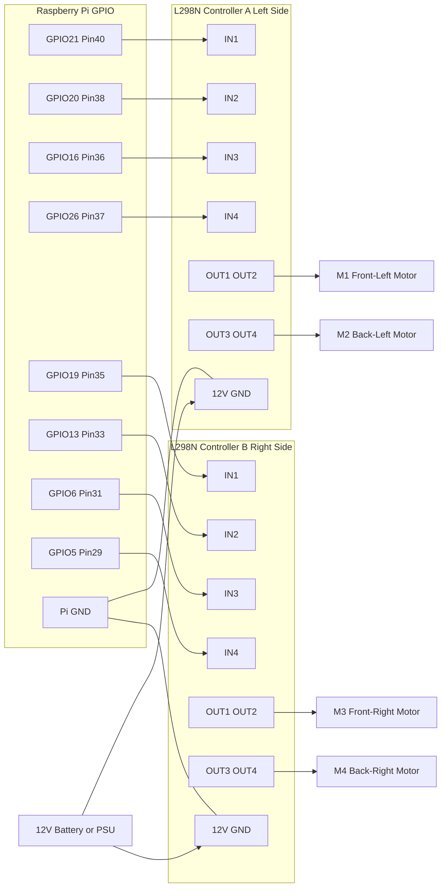
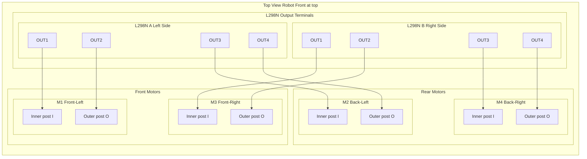
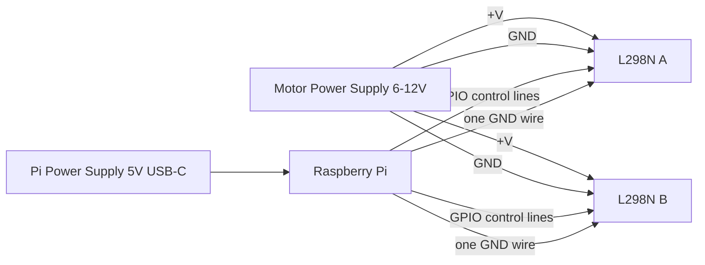
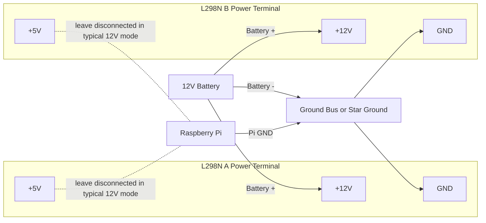

# Dual L298N Motor Wiring Diagram (4 Motors)

This is the equivalent of an M1/M2/M3/M4 motor map, but for **2x L298N drivers** as used in this project.

## Motor Position Layout

## Driver Assignment

- **L298N Controller A** = Left side motors
  - Motor A output (OUT1/OUT2) → **M1 (Front-Left)**
  - Motor B output (OUT3/OUT4) → **M2 (Back-Left)**
- **L298N Controller B** = Right side motors
  - Motor A output (OUT1/OUT2) → **M3 (Front-Right)**
  - Motor B output (OUT3/OUT4) → **M4 (Back-Right)**

## Signal Wiring (Pi GPIO → L298N IN Pins)

### GPIO to L298N Pin Mapping

| Motor | Wheel Position | GPIO Forward | GPIO Backward | Driver | L298N Input Pins |
|---|---|---|---|---|---|
| M1 | Front-Left | GPIO 21 (Pin 40) | GPIO 20 (Pin 38) | Controller A | IN1 / IN2 |
| M2 | Back-Left | GPIO 16 (Pin 36) | GPIO 26 (Pin 37) | Controller A | IN3 / IN4 |
| M3 | Front-Right | GPIO 19 (Pin 35) | GPIO 13 (Pin 33) | Controller B | IN1 / IN2 |
| M4 | Back-Right | GPIO 6 (Pin 31) | GPIO 5 (Pin 29) | Controller B | IN3 / IN4 |

## Motor Output Wiring (L298N OUT Pins → Motor Posts)

### Top-Down Motor Post Wiring (Exact OUTx → Motor Terminals)

To avoid mixing wires, label each motor's two tabs before wiring:

- **Inner post (I)** = motor tab facing the center of the robot
- **Outer post (O)** = motor tab facing the outside edge of the robot

Use this reference orientation while labeling: robot front at top, viewed from above.

### Output-to-Post Table

| Motor | Driver Output | Connect To Motor Post |
|---|---|---|
| M1 Front-Left | A OUT1 | M1 Inner (I) |
| M1 Front-Left | A OUT2 | M1 Outer (O) |
| M2 Back-Left | A OUT3 | M2 Inner (I) |
| M2 Back-Left | A OUT4 | M2 Outer (O) |
| M3 Front-Right | B OUT1 | M3 Inner (I) |
| M3 Front-Right | B OUT2 | M3 Outer (O) |
| M4 Back-Right | B OUT3 | M4 Inner (I) |
| M4 Back-Right | B OUT4 | M4 Outer (O) |

If one wheel spins opposite of expected, swap only that motor's two wires (I/O) or invert in software.

## Power Wiring (Separate Pi + Motor Supplies)

### Power Notes

- Keep **ENA/ENB jumpers installed** on both L298N boards unless you wire separate PWM speed control to EN pins.
- Connect both L298N grounds and Raspberry Pi ground together (common ground).
- Do **not** power motors from Raspberry Pi 5V.

### Separate Power Supplies (Pi + Motors)

Use two independent supplies:

- **Pi PSU**: 5V USB-C supply to Raspberry Pi only
- **Motor PSU**: 6-12V (or your motor rated voltage) to both L298N boards

### Critical dual-supply rules

- Keep **positive rails separate**: do not connect Pi 5V to motor +V.
- **Grounds must be common**: Pi GND must connect to L298N GND/motor PSU GND.
- Prefer a star ground point at motor PSU negative or a clean GND bus.
- Keep high-current motor wires away from Pi signal wires when possible.

### Terminal-by-Terminal Power Wiring (Detailed)

For each L298N board, the 3-pin power screw terminal is typically labeled:

- **`+12V`** (sometimes `VS`, `Vmotor`, or `+V`) = motor supply positive input
- **`GND`** = motor supply negative / common ground
- **`5V`** = logic 5V rail on the module (behavior depends on jumper)

### 3-Terminal Block Detail (12V setup)

In this 12V configuration:

- L298N `+12V` gets only battery positive.
- L298N `GND` gets battery negative and Pi ground (prefer via ground bus/star point).
- L298N `+5V` is not used as a motor input.
- Pi stays on its own 5V USB-C power supply.

### Exactly where to connect each power wire

For **L298N A** and **L298N B**:

1. Motor PSU `+` → L298N `+12V` (or `VS/+V`) terminal
2. Motor PSU `-` → L298N `GND` terminal
3. Raspberry Pi GND pin → L298N `GND` terminal (or same ground bus)

Repeat for both driver boards so all grounds are tied together.

### Practical terminal note

Most screw terminals hold one wire best. If needed, use a small terminal block/WAGO as a ground splitter so battery `-` and Pi GND both reach each L298N `GND` cleanly.

### Does GPIO mapping change with separate supplies?

No. GPIO mapping is unchanged. Power wiring and signal wiring are independent as long as grounds are common.

Use the same mapping already defined:

- GPIO21/20 → Controller A IN1/IN2 (M1)
- GPIO16/26 → Controller A IN3/IN4 (M2)
- GPIO19/13 → Controller B IN1/IN2 (M3)
- GPIO6/5 → Controller B IN3/IN4 (M4)

### About the L298N `5V` pin and jumper

- If `5V-EN` (or `EN-5V`) jumper is installed, the module's onboard regulator usually powers logic from motor input.
- In that common setup, leave Pi 5V disconnected from the L298N `5V` pin.
- If your board requires external 5V logic (jumper removed), provide a stable 5V logic source to L298N `5V` and keep common ground.
- Do not use L298N `5V` pin to power the Raspberry Pi.
