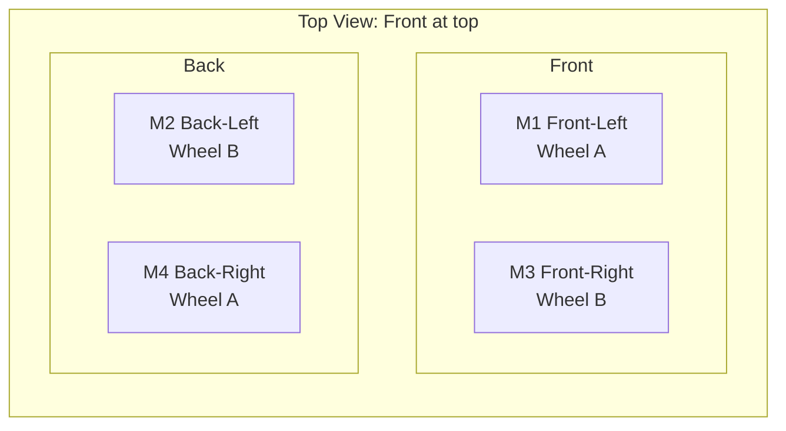

# Mecanum Wheel Installation and Movement Concepts

This document captures the wheel-orientation concepts from the wheel kit sheet and maps them to this project's motor naming.

It does **not** change wiring or code behavior; it only clarifies how to mount wheels and understand motion.

## Wheel Type Placement (A/B Pattern)

Use this top-view arrangement:

- **Front-Left (M1): Wheel A**
- **Front-Right (M3): Wheel B**
- **Back-Left (M2): Wheel B**
- **Back-Right (M4): Wheel A**

This is the same A/B checker pattern shown in many mecanum kits (A on one diagonal, B on the other).

## How to Install the Wheels

1. Lay the chassis on a bench with the robot **front** clearly marked.
2. Identify wheel types from the kit: **A** and **B**.
3. Mount wheels using the A/B positions above.
4. Tighten wheel couplers/set screws so each wheel is centered and secure.
5. Spin each wheel by hand to confirm no rubbing on the chassis.
6. Before power-on, verify your motor IDs match software mapping:
   - `M1` = front-left
   - `M2` = back-left
   - `M3` = front-right
   - `M4` = back-right

## Movement Concepts (Using Project Motor Names)

The kit movement table is based on clockwise/counter-clockwise wheel rotation. In this project, you usually think in motor power vectors instead.

### Core movement vectors used by code

From `robot/mecanum.py`:

- **Forward**: `[+1, +1, +1, +1]`
- **Strafe Left**: `[-1, +1, +1, -1]`
- **Rotate Left**: `[-1, -1, +1, +1]`

Format is `[M1, M2, M3, M4]`.

### Practical note about CW/CCW tables

Vendor tables often define CW/CCW from a specific viewpoint (outside of wheel or motor side). If your observed CW/CCW seems inverted, that usually means the viewing convention differs—not that the mecanum math is wrong.

## Bench Verification (Fast)

After wiring and mounting:

1. Run `sudo python3 tests/test_motors.py` and confirm each motor index matches physical location.
2. Run `sudo python3 tests/test_movements.py` and verify:
   - Forward goes straight
   - Strafe left/right is lateral
   - Rotation is centered
3. If one wheel direction is wrong, swap only that motor's two output wires at the L298N.

## Related Docs

- Wiring workflow: [GPIO_WIRING_GUIDE.md](GPIO_WIRING_GUIDE.md)
- Exact GPIO/OUT/power maps: [L298N_DUAL_DRIVER_DIAGRAM.md](L298N_DUAL_DRIVER_DIAGRAM.md)
